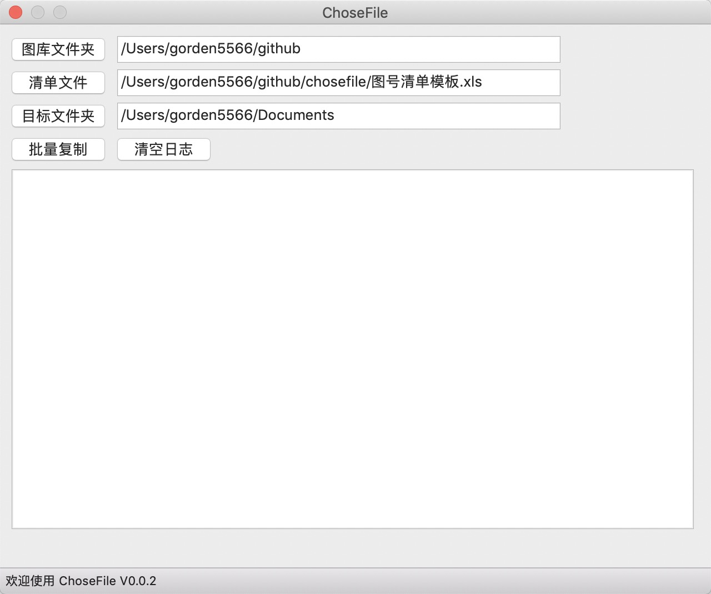

# chosefile



安装依赖
```shell
# wxPython
pip3 install wxPython -i https://pypi.mirrors.ustc.edu.cn/simple/

# xlrd
pip3 install xlrd -i https://pypi.mirrors.ustc.edu.cn/simple/

# xlwt
pip3 install xlwt -i https://pypi.mirrors.ustc.edu.cn/simple/
```

打包命令

```python
pyinstaller chosefile.py --noconsole
```

打包单个文件的命令

```python
pyinstaller -F chosefile.py --noconsole
```
